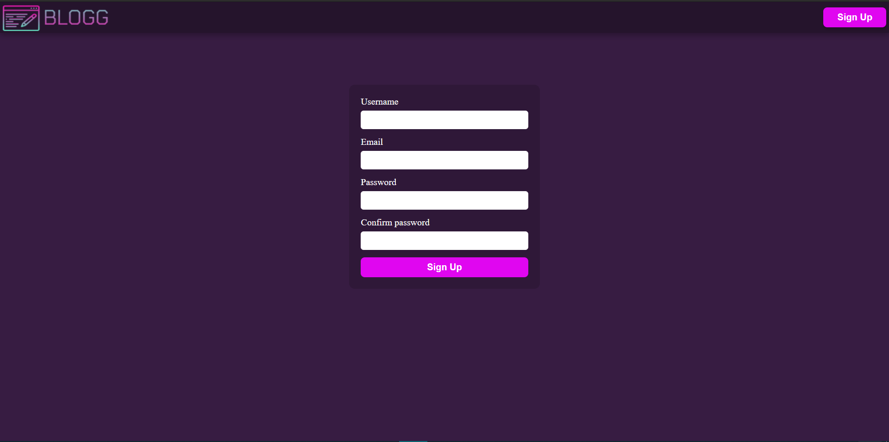
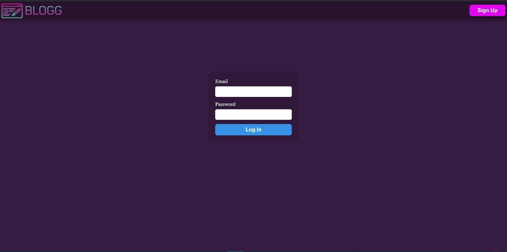
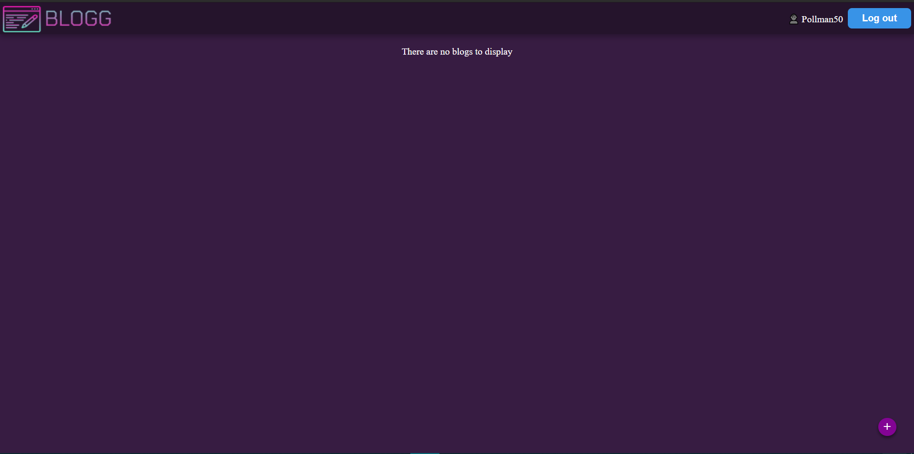
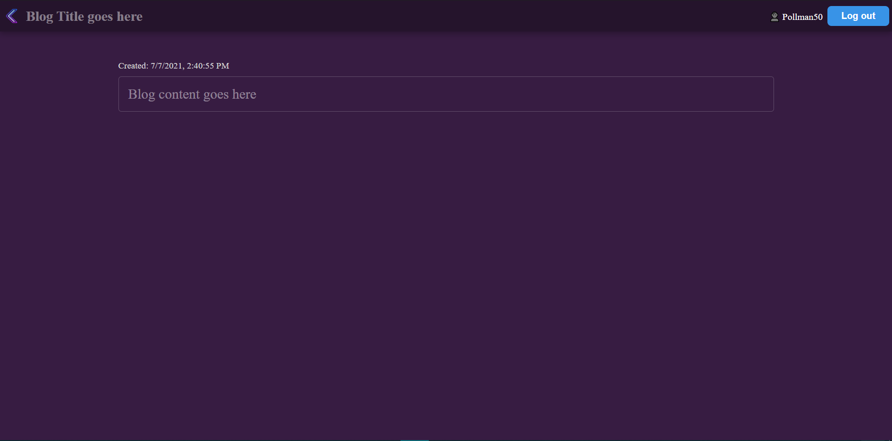
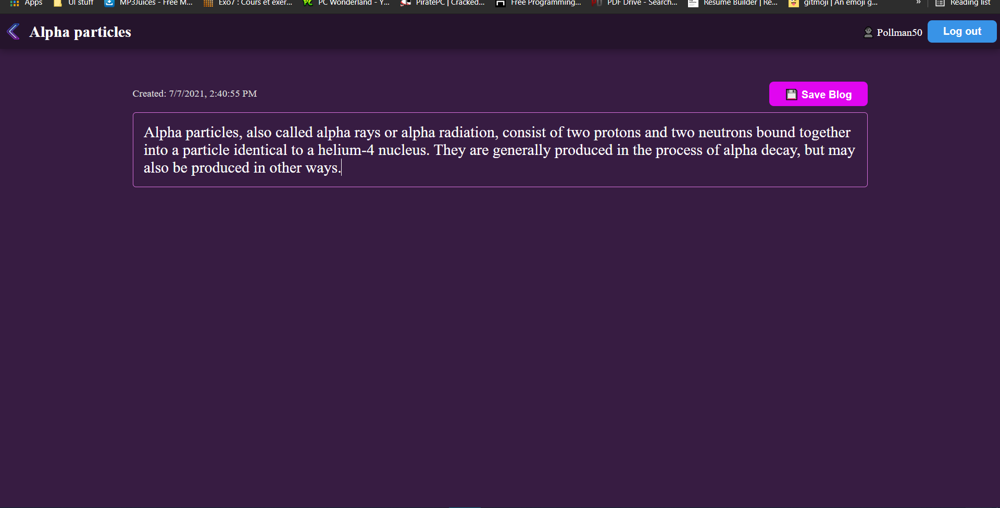
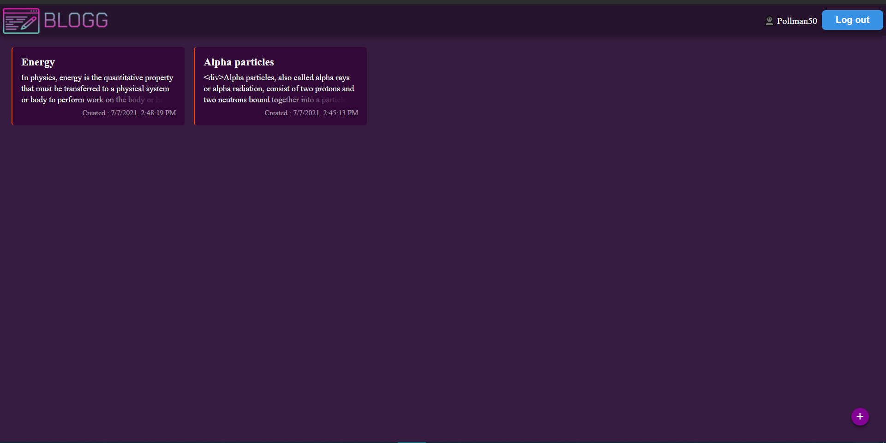
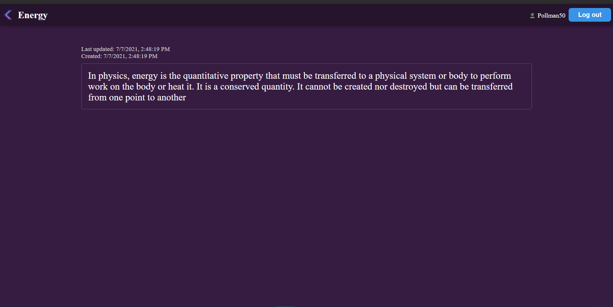

This is a simple frontend implementation of
the [BLOGG](https://github.com/lokaimoma/BLOGG)
api backend built with Fast API. There are a lot
of issues with this implementation, but this is
created to give a feel of the API.

## Screenshots

---
 






## Requirements

[Node Js](https://nodejs.org/en/)

## How To Test
+ ### Clone the project
```bash
git clone git@github.com:lokaimoma/BLOGG_Svelte_Front_End.git
```
+ ### Change directory in to the project directory
```bash
cd BLOGG_Svelte_Front_End
```
+ ### Install dependencies
```
npm install
```
+ ## Run project
```
npm run dev
```

## Current Problems
+ Routing isn't perfect.
+ User authenication is not secure.
+ Some buttons may not work (Not implemented yet) 
